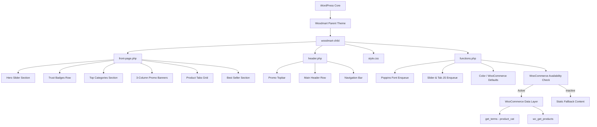
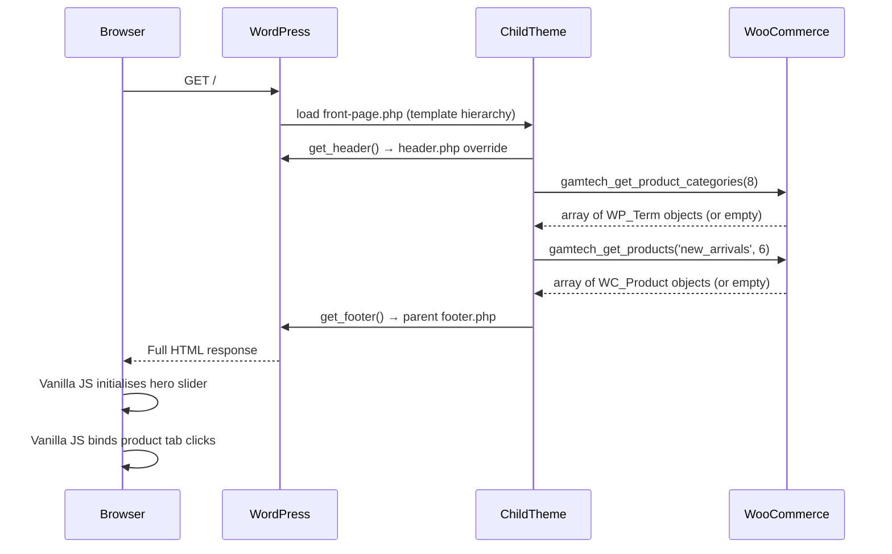
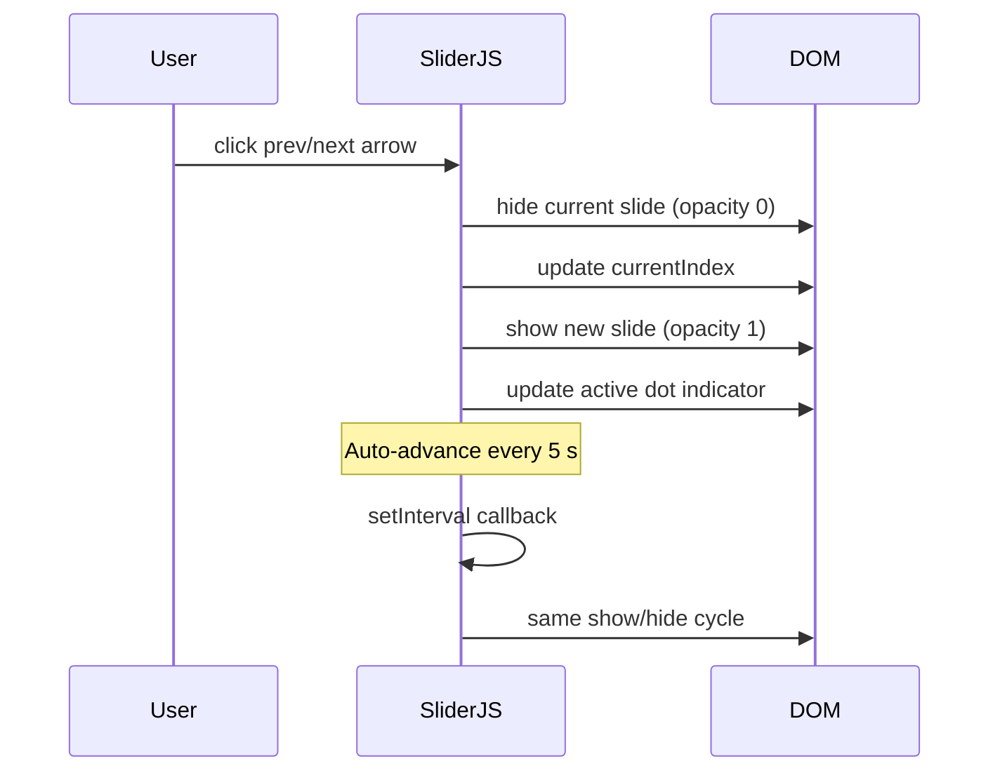

# Design Document: Gamtech Electronic Homepage Redesign (Ogo-Style)

## Overview

Rebuild the Gamtech Electronic WordPress homepage by overriding the Woodmart child theme with a complete, self-contained Ogo-style electronics marketplace layout. The redesign covers four child-theme files — `header.php`, `front-page.php`, `style.css`, and `functions.php` — delivering a modern white-and-red storefront with live WooCommerce data and graceful static fallbacks.

The implementation is intentionally scoped to the child theme only; the parent Woodmart theme remains untouched and continues to provide its infrastructure (body wrapper, `wp_head/wp_footer` hooks, WooCommerce integration). Vanilla JavaScript drives the hero slider and product tabs, and Poppins is loaded from Google Fonts.

---

## Architecture



---

## Sequence Diagrams

### Page Load Flow



### Hero Slider Interaction



---

## Components and Interfaces

### Component 1: Header (`header.php`)

**Purpose**: Override the parent Woodmart header with the Ogo-style three-row header while keeping `<html>`, `<head>`, `wp_head()`, and `<body>` intact.

**Interface**:
```php
// Outputs three header zones:
gamtech_render_topbar();   // Promo bar with close button
gamtech_render_main_header(); // Logo + search + contact + icons
gamtech_render_navbar();   // Category dropdown + nav links + auth
```

**Responsibilities**:
- Render dismissible promo topbar via inline JS (`localStorage` flag)
- Render search form pointing to `/?s=` (WordPress native search)
- Render WooCommerce cart count badge via `WC()->cart->get_cart_contents_count()`
- Render navigation using `wp_nav_menu()` for the `primary` menu location
- Output `<div class="main-page-wrapper">` which the parent `footer.php` closes

---

### Component 2: Front Page Template (`front-page.php`)

**Purpose**: Full homepage layout, loaded by WordPress template hierarchy when a static front page is set or when the file exists.

**Interface**:
```php
get_header();

gamtech_render_hero_slider();       // Section: hero
gamtech_render_trust_badges();      // Section: trust
gamtech_render_top_categories();    // Section: categories
gamtech_render_promo_banners();     // Section: banners
gamtech_render_product_tabs();      // Section: products
gamtech_render_best_sellers();      // Section: best sellers

get_footer();
```

**Responsibilities**:
- Each render function outputs self-contained HTML
- WooCommerce functions are gated behind `gamtech_woo_active()`
- Static fallback arrays mirror live data structure so markup is identical

---

### Component 3: Stylesheet (`style.css`)

**Purpose**: All visual styling for the redesign — resets, layout, components, responsive breakpoints.

**Interface** (CSS custom properties):
```css
:root {
  --gt-red:        #e74c3c;
  --gt-red-dark:   #c0392b;
  --gt-text:       #333333;
  --gt-muted:      #666666;
  --gt-border:     #e0e0e0;
  --gt-bg-light:   #f5f5f5;
  --gt-white:      #ffffff;
  --gt-font:       'Poppins', sans-serif;
  --gt-radius:     4px;
  --gt-shadow:     0 2px 8px rgba(0,0,0,0.08);
  --gt-transition: 0.25s ease;
}
```

**Responsibilities**:
- Define layout grid for all six homepage sections
- Style header rows, dropdowns, cart badge
- Hero slider: full-width, fixed height (500 px desktop / 300 px mobile), fade transition
- Trust badges: 5-column flex row
- Category tiles: horizontal scroll strip with active red-border state
- Promo banners: 3-column CSS grid
- Product card: hover shadow, image zoom, rating stars
- Best-seller: 1 large card + 4-card right grid
- Responsive: one breakpoint at 768 px (stack to single column)

---

### Component 4: Functions (`functions.php`)

**Purpose**: Enqueue assets, register menu locations, expose helper functions used in templates.

**Interface**:
```php
// Asset enqueueing
function gamtech_enqueue_assets(): void
function gamtech_enqueue_inline_slider_js(): void

// WooCommerce helpers
function gamtech_woo_active(): bool
function gamtech_get_product_categories(int $limit = 8): array  // WP_Term[]|static[]
function gamtech_get_products(string $tab = 'new_arrivals', int $limit = 6): array  // WC_Product[]|static[]
function gamtech_get_star_html(float $rating): string  // returns HTML string

// Theme setup
function gamtech_theme_setup(): void   // register menus, image sizes
```

---

## Data Models

### ProductCard (used in product grid and best-sellers)

```php
// WooCommerce live:
interface ProductCard {
  id:         int       // WC_Product::get_id()
  name:       string    // WC_Product::get_name()
  category:   string    // first product category term name
  price:      string    // WC_Product::get_price_html()
  sale_price: string    // WC_Product::get_sale_price()
  regular_price: string // WC_Product::get_regular_price()
  on_sale:    bool      // WC_Product::is_on_sale()
  image_url:  string    // wp_get_attachment_image_url()
  permalink:  string    // get_permalink()
  rating:     float     // WC_Product::get_average_rating()
  review_count: int     // WC_Product::get_review_count()
}
```

**Validation Rules**:
- `name` must be non-empty; fall back to "Unnamed Product"
- `image_url` falls back to `wc_placeholder_img_src()` when empty
- `rating` is clamped to `[0, 5]`; display empty stars for 0

---

### CategoryTile (used in top-categories strip)

```php
interface CategoryTile {
  slug:      string   // WP_Term::slug
  name:      string   // WP_Term::name
  count:     int      // WP_Term::count
  image_url: string   // term meta 'thumbnail_id' → attachment URL
  link:      string   // get_term_link()
}
```

**Validation Rules**:
- `image_url` falls back to a generic SVG placeholder when not set
- `count` ≥ 0; zero-count categories are still displayed

---

### HeroSlide (used in hero slider)

```php
interface HeroSlide {
  badge_text:    string   // e.g. "Save $7.99"
  headline:      string
  sub_headline:  string
  cta_text:      string
  cta_url:       string
  image_url:     string   // product/lifestyle image
  bg_color:      string   // CSS colour string, default "#f0f4f8"
}
```

**Validation Rules**:
- Slides array must contain at least 1 item
- `cta_url` must be a valid URL; falls back to `home_url('/')`

---

## Algorithmic Pseudocode

### Hero Slider Initialization

```pascal
PROCEDURE initHeroSlider()
  INPUT: none (reads DOM)
  OUTPUT: side effects on DOM
  
  slides      ← querySelectorAll('.gt-slide')
  dots        ← querySelectorAll('.gt-slider-dot')
  currentIdx  ← 0
  totalSlides ← slides.length
  
  IF totalSlides < 2 THEN RETURN END IF
  
  PROCEDURE showSlide(idx)
    FOR each slide IN slides DO
      slide.classList.remove('active')
    END FOR
    FOR each dot IN dots DO
      dot.classList.remove('active')
    END FOR
    slides[idx].classList.add('active')
    dots[idx].classList.add('active')
  END PROCEDURE
  
  PROCEDURE advance()
    currentIdx ← (currentIdx + 1) MOD totalSlides
    showSlide(currentIdx)
  END PROCEDURE
  
  querySelector('.gt-slider-prev').addEventListener('click', LAMBDA:
    currentIdx ← (currentIdx - 1 + totalSlides) MOD totalSlides
    showSlide(currentIdx)
  )
  querySelector('.gt-slider-next').addEventListener('click', LAMBDA:
    currentIdx ← (currentIdx + 1) MOD totalSlides
    showSlide(currentIdx)
  )
  
  autoTimer ← setInterval(advance, 5000)
  showSlide(0)
END PROCEDURE
```

**Preconditions:**
- DOM contains at least one `.gt-slide` element
- `.gt-slider-prev` and `.gt-slider-next` elements exist

**Postconditions:**
- Exactly one slide has class `active` at all times
- `currentIdx` remains in range `[0, totalSlides - 1]`

**Loop Invariants:**
- `slides` and `dots` arrays are not mutated after initialization
- `currentIdx MOD totalSlides` is always a valid index

---

### Product Tab Switching

```pascal
PROCEDURE initProductTabs()
  INPUT: none (reads DOM)
  OUTPUT: side effects on DOM
  
  tabs     ← querySelectorAll('.gt-tab-link')
  panels   ← querySelectorAll('.gt-tab-panel')
  
  PROCEDURE activateTab(targetId)
    FOR each tab IN tabs DO
      IF tab.dataset.target = targetId THEN
        tab.classList.add('active')
      ELSE
        tab.classList.remove('active')
      END IF
    END FOR
    FOR each panel IN panels DO
      IF panel.id = targetId THEN
        panel.classList.add('active')
      ELSE
        panel.classList.remove('active')
      END IF
    END FOR
  END PROCEDURE
  
  FOR each tab IN tabs DO
    tab.addEventListener('click', LAMBDA:
      activateTab(tab.dataset.target)
    )
  END FOR
  
  // Activate first tab on load
  IF tabs.length > 0 THEN
    activateTab(tabs[0].dataset.target)
  END IF
END PROCEDURE
```

**Preconditions:**
- Each `.gt-tab-link` has `data-target` matching an existing panel `id`
- At least one tab/panel pair exists

**Postconditions:**
- Exactly one tab and its paired panel have class `active`
- All other tabs/panels have `active` removed

---

### WooCommerce Product Fetch with Fallback

```pascal
FUNCTION gamtech_get_products(tab, limit)
  INPUT:  tab   ∈ {'new_arrivals', 'featured', 'on_sale'}
          limit ∈ ℤ⁺
  OUTPUT: products[] — uniform ProductCard array
  
  IF NOT gamtech_woo_active() THEN
    RETURN gamtech_static_product_fallback(limit)
  END IF
  
  args ← base_query_args(limit)
  
  CASE tab OF
    'new_arrivals': args.orderby ← 'date'; args.order ← 'DESC'
    'featured':     args.tax_query ← [taxonomy: 'product_visibility', term: 'featured']
    'on_sale':      args.post__in ← wc_get_product_ids_on_sale()
  END CASE
  
  raw_products ← wc_get_products(args)
  
  RETURN MAP raw_products TO ProductCard {
    id:            p.get_id(),
    name:          p.get_name() OR 'Unnamed Product',
    category:      first_category(p) OR '',
    price:         p.get_price_html(),
    on_sale:       p.is_on_sale(),
    sale_price:    p.get_sale_price(),
    regular_price: p.get_regular_price(),
    image_url:     product_image_url(p) OR wc_placeholder_img_src(),
    permalink:     get_permalink(p.get_id()),
    rating:        clamp(p.get_average_rating(), 0, 5),
    review_count:  p.get_review_count()
  }
END FUNCTION
```

**Preconditions:**
- `tab` is one of the three valid string values
- `limit` is a positive integer

**Postconditions:**
- Returns an array of length ≤ `limit`
- Every element conforms to the ProductCard interface
- No element has a null `image_url` (guaranteed by fallback)

**Loop Invariants:**
- Mapping preserves order from `wc_get_products` result
- Each mapped element is independent (no cross-references)

---

### Topbar Dismissal

```pascal
PROCEDURE initTopbarDismiss()
  INPUT: none (reads localStorage)
  OUTPUT: side effects on DOM
  
  topbar  ← querySelector('.gt-topbar')
  closeBtn ← querySelector('.gt-topbar-close')
  
  IF localStorage.getItem('gt_topbar_dismissed') = 'true' THEN
    topbar.style.display ← 'none'
    RETURN
  END IF
  
  closeBtn.addEventListener('click', LAMBDA:
    topbar.style.display ← 'none'
    localStorage.setItem('gt_topbar_dismissed', 'true')
  )
END PROCEDURE
```

**Preconditions:**
- `.gt-topbar` and `.gt-topbar-close` elements exist in the DOM

**Postconditions:**
- If previously dismissed: topbar is hidden immediately on page load
- If close clicked: topbar is hidden and flag is persisted

---

## Key Functions with Formal Specifications

### `gamtech_woo_active() : bool`

**Preconditions:** WordPress is fully loaded

**Postconditions:**
- Returns `true` if and only if WooCommerce plugin is active
- No side effects

---

### `gamtech_get_product_categories(int $limit) : array`

**Preconditions:** `$limit > 0`

**Postconditions:**
- Returns array of length ≤ `$limit`
- Each element has fields: `slug`, `name`, `count`, `image_url`, `link`
- If WooCommerce inactive: returns static array with identical structure
- `image_url` is always a non-empty string (SVG placeholder fallback)

---

### `gamtech_get_products(string $tab, int $limit) : array`

**Preconditions:**
- `$tab ∈ {'new_arrivals', 'featured', 'on_sale'}`
- `$limit > 0`

**Postconditions:**
- Returns array of length ≤ `$limit`
- Every element conforms to the ProductCard interface
- `image_url` is always non-empty
- `rating` is in `[0, 5]`

---

### `gamtech_get_star_html(float $rating) : string`

**Preconditions:** `$rating ∈ [0, 5]`

**Postconditions:**
- Returns HTML string containing exactly 5 `<span>` star elements
- Stars `floor($rating)` are marked filled; remainder empty
- Output is safe for `echo` (no unescaped user data)

---

## Example Usage

```php
// In front-page.php:

get_header(); // loads header.php override

$slides = [
  [
    'badge_text'   => 'Save $7.99',
    'headline'     => 'Galaxy C9 Pro',
    'sub_headline' => 'Big Performance. Sleek Design.',
    'cta_text'     => 'Shop Now',
    'cta_url'      => home_url('/shop'),
    'image_url'    => get_stylesheet_directory_uri() . '/images/hero-phone.png',
    'bg_color'     => '#f0f4f8',
  ],
];
gamtech_render_hero_slider($slides);

$categories = gamtech_get_product_categories(8);
gamtech_render_top_categories($categories);

$new_arrivals = gamtech_get_products('new_arrivals', 6);
$featured     = gamtech_get_products('featured', 6);
$on_sale      = gamtech_get_products('on_sale', 6);
gamtech_render_product_tabs($new_arrivals, $featured, $on_sale);

get_footer();
```

```javascript
// Auto-initialised in footer-inline script (functions.php):
document.addEventListener('DOMContentLoaded', function () {
  initHeroSlider();
  initProductTabs();
  initTopbarDismiss();
  initBestSellerTabs();
});
```

---

## Error Handling

### Scenario 1: WooCommerce Not Active

**Condition**: `class_exists('WooCommerce')` returns false

**Response**: Every data-fetching helper (`gamtech_get_product_categories`, `gamtech_get_products`) returns a pre-defined static array that mirrors the live data structure exactly. Cart icon shows a static `0` badge.

**Recovery**: No user-visible error. Content appears normal. When WooCommerce is activated, functions automatically switch to live data on next page load.

---

### Scenario 2: No Products Found for a Tab

**Condition**: `wc_get_products()` returns an empty array for a given tab

**Response**: The tab panel renders a friendly "No products found" message in place of the product grid.

**Recovery**: When products are added to WooCommerce matching the tab criteria, they appear automatically.

---

### Scenario 3: Category Has No Thumbnail Image

**Condition**: A product category term has no associated thumbnail image

**Response**: `gamtech_get_product_categories()` returns a generic grey SVG placeholder as the `image_url`.

**Recovery**: Admin can set a category image in WooCommerce → Products → Categories at any time.

---

### Scenario 4: JavaScript Disabled

**Condition**: Browser has JavaScript disabled

**Response**: All page content is visible via HTML/CSS. Hero shows first slide (CSS default). All product tabs show their panels stacked (CSS fallback — `.gt-tab-panel { display: block }`). Topbar is always visible.

**Recovery**: No JS required for content accessibility. Slider and tabs are progressive enhancements.

---

### Scenario 5: Primary Navigation Menu Not Assigned

**Condition**: WordPress admin has not assigned a menu to the `primary` location

**Response**: `wp_nav_menu()` renders a fallback list of pages via the `fallback_cb` parameter.

**Recovery**: Admin assigns a menu under Appearance → Menus.

---

## Testing Strategy

### Unit Testing Approach

Test the PHP helper functions in isolation using PHPUnit with WooCommerce mocked or bypassed:

- `gamtech_woo_active()` — assert returns bool; test both active/inactive states
- `gamtech_get_products()` with invalid `$tab` — assert graceful fallback (returns static data, no PHP error)
- `gamtech_get_star_html()` — assert exactly 5 stars returned; assert correct fill count for ratings 0, 2.5, 5
- `gamtech_get_product_categories()` — assert every item has required keys; assert `image_url` is never empty

### Property-Based Testing Approach

**Property Test Library**: PHPUnit + a simple property test helper (or `eris/eris` for PHP property-based testing)

Properties to validate:
- For any integer `$limit ≥ 1`, `count(gamtech_get_products(...)) ≤ $limit`
- For any float `$rating ∈ [0, 5]`, `gamtech_get_star_html($rating)` contains exactly 5 star elements
- For any product array, `gamtech_render_product_card()` output contains the product name

### Integration Testing Approach

Browser-level (manual or Cypress):
- Hero slider auto-advances every 5 s; prev/next arrows update the active slide
- Clicking a product tab shows the correct panel and hides others
- Topbar close button hides the bar and persists the dismissed state in `localStorage`
- Cart count badge updates when WooCommerce cart changes (requires WooCommerce active)

---

## Performance Considerations

- Hero slider images should be pre-optimised (WebP, max 800 KB each)
- `gamtech_get_products()` results should be wrapped in a transient cache (`get_transient` / `set_transient`) with a 1-hour TTL to avoid repeated WooCommerce DB queries on every page load
- Poppins font is loaded from Google Fonts with `display=swap` to prevent render-blocking
- The child theme's `style.css` should be minified for production; a `style.min.css` can be generated and conditionally loaded via `SCRIPT_DEBUG` constant

---

## Security Considerations

- All PHP template output uses `esc_html()`, `esc_url()`, `esc_attr()`, and `wp_kses_post()` appropriately
- Search form uses WordPress nonce-free `GET` method (safe for search)
- Cart count is fetched via WooCommerce's own API — no raw SQL
- `localStorage` key `gt_topbar_dismissed` stores only the string `'true'`; no PII is stored client-side
- No inline SQL; all data retrieved through WP/WC abstraction layers

---

## Dependencies

| Dependency | Type | Purpose |
|---|---|---|
| WordPress ≥ 6.0 | Core | Template hierarchy, `wp_head/footer`, menu registration |
| Woodmart Parent Theme | Theme parent | Body wrapper, `wp_enqueue_style('woodmart-style')`, `woodmart_get_opt()` |
| WooCommerce ≥ 7.0 | Plugin (optional) | Product data, cart count, term thumbnails |
| Google Fonts — Poppins | External CDN | Body typeface (300, 400, 500, 600, 700 weights) |
| Vanilla JS (ES6+) | Inline / enqueued | Hero slider, product tabs, topbar dismiss |
| No jQuery dependency | — | Vanilla JS only; jQuery not required |

---

## Correctness Properties

*A property is a characteristic or behavior that should hold true across all valid executions of a system — essentially, a formal statement about what the system should do. Properties serve as the bridge between human-readable specifications and machine-verifiable correctness guarantees.*

### Property 1: Product Fetch Respects Limit

For any positive integer `$limit` and any valid `$tab` value (`'new_arrivals'`, `'featured'`, `'on_sale'`), `gamtech_get_products($tab, $limit)` SHALL return an array whose length is ≤ `$limit`.

**Validates: Requirements 12.3**

### Property 2: Product Cards Are Complete

For any product returned by `gamtech_get_products()`, every ProductCard element in the returned array SHALL have a non-empty `image_url` and a `rating` value in the closed interval [0, 5], so that all product card markup renders without errors.

**Validates: Requirements 8.7, 12.3**

### Property 3: Star HTML Is Well-Formed

For any float `$rating` in [0, 5], `gamtech_get_star_html($rating)` SHALL return an HTML string containing exactly 5 star elements, with `floor($rating)` of them marked as filled.

**Validates: Requirements 12.5**

### Property 4: Category Array Is Complete

For any positive integer `$limit`, `gamtech_get_product_categories($limit)` SHALL return an array of length ≤ `$limit` where every element has non-empty `name`, `slug`, `link`, and `image_url` fields — with a placeholder substituted for any category that has no assigned thumbnail.

**Validates: Requirements 6.2, 6.4, 6.5, 12.2**

### Property 5: Static Fallback Structural Equivalence

For any call to `gamtech_get_products()` or `gamtech_get_product_categories()` when WooCommerce is inactive, the returned Static_Fallback array SHALL contain the same set of top-level keys as the equivalent live WooCommerce response, so that all template markup renders without PHP notices regardless of plugin state.

**Validates: Requirements 6.3, 8.5, 12.4**

### Property 6: Slider Index Invariant

For any hero slider with N slides (N ≥ 2) and any sequence of previous/next arrow interactions starting from any valid `currentIndex`, the slider's `currentIndex` SHALL always equal `(previousIndex ± 1 + N) % N`, remaining within the range `[0, N − 1]`, and exactly one dot indicator SHALL be active at all times.

**Validates: Requirements 4.3, 4.4, 4.5**

### Property 7: Tab Mutual Exclusivity

For any product tabs component with T tab/panel pairs and any tab click event targeting tab `i`, exactly one tab link (tab `i`) SHALL have the `active` class and exactly one panel (panel `i`) SHALL have the `active` class after the interaction completes — all other T − 1 tabs and panels SHALL not have the `active` class.

**Validates: Requirements 8.2**
